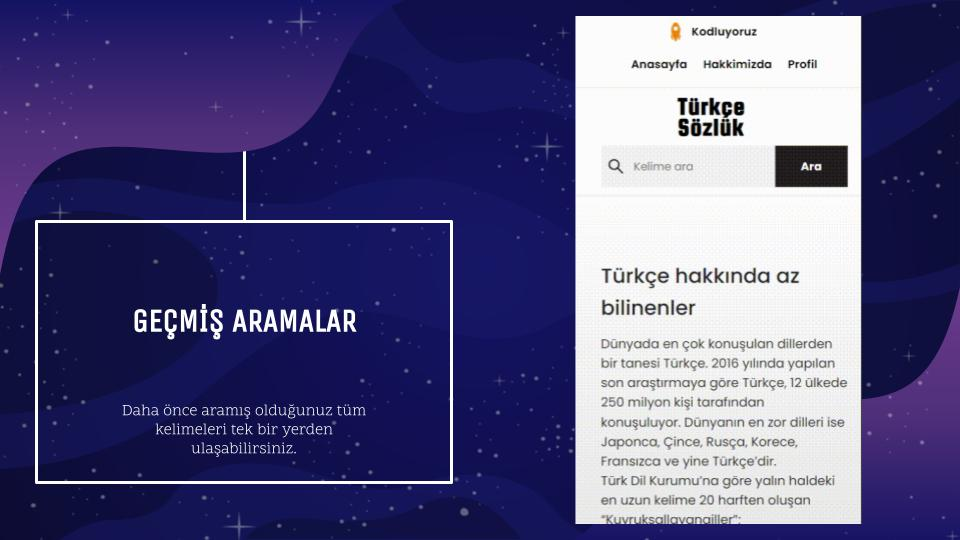

# Türkçe Sözlük Projesi

Bu proje halihazırda bulunan sözlüğümüzün eksik kalan taraflarını tamamlama ve daha iyi hale getirebilme amacıyla yapılmıştır.

## Neden Sözlük Projesi ?

Sözlük projesini seçmemizin sebebini gelin maddeler ile sıralayalım;

- Yapılan aramalar sonucu çıkan sonucu paylaşma güçlüğü
- Yeterince hızlı değil, eski teknoloji..
- Tasarım

### Yapılan Aramalar Ssonrasında Sonucu Paylaşamama

Aşağıdaki görsel iki siteninde arama sonucu gösteriliyor. URL kısmına dikkatle bakacak olursanız eğer birisinde neyin arandığı net bir şekilde gözükürken diğerinde ise böyle bir özellik yer almıyor. Bu da yapılan sorguları paylaşma konusunda problem yaratıyordu bize, bunu düzelttik.

### Yeterince Hızlı Değil, Eski Teknoloji

Halihazırda bulunan sözlükte jQuery kullanışmış durumda. ReactJS geliştirilmeden evvel, geliştiriciler kullanıcı arayüzleri geliştirirken -vanilla JavaScript- veya -jQuery- gibi diğer JavaScript kütüphanelerini kullanıyordu. Bu kütüphaneler ise daha az kullanıcı arayüzü odaklıydı. Dolayısıyla birçok hata ve bug ile karşılaşılıyor, bu da sürecin zorlaşmasına ve vakit kaybına sebep oluyordu.

JQuery veya Javascript geliştirirken gerçek DOM üzerinden işlem yapılmaktadır. Real Dom’da değişiklik olmayan yerlerde tekrardan taranır ve render edilir. Ancak React Virtual Dom mimarisini kullanarak sadece değişikliğin olduğu yeri tekrar render eder.

### Tasarım

Tasarım konusuna değinecek olursak iyidir yada kötüdür bunlar kişiden kişiye değişiklik gösteren şeyler ama herkesin hem fikir olduğu konular da vardır. Bu anlamda iyileştirme çabalarımız oldu, daha nefes alabilir bir tasarım çıkarmaya çalıştık.

## Kullanılan Teknolojiler

  
 

## Yapmış Olduğumuz Yenilikler

### Favori Kelimeler

### Geçmiş Aranalar

## Görünüm

## Hazırlayanlar

### Ercüment Laçın

- ercument.lacin@gmail.com
- https://www.linkedin.com/in/ercument-lacin
- http://github.com/ercumentlacin

### İsmail Hanadi

- ismailhanadi96@gmail.com
- https://www.linkedin.com/in/ihanadi
- https://github.com/ihanadi
